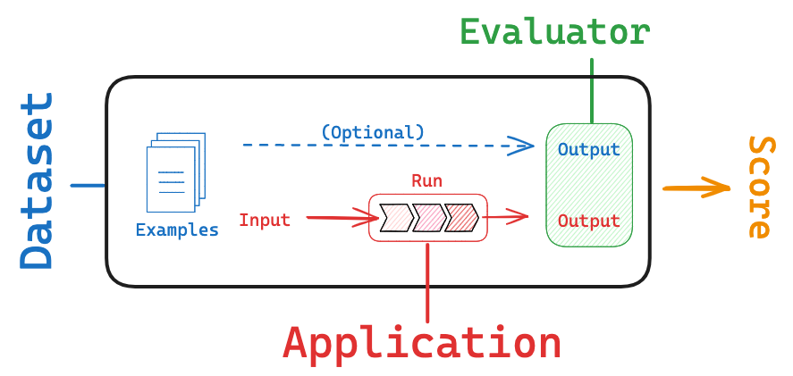
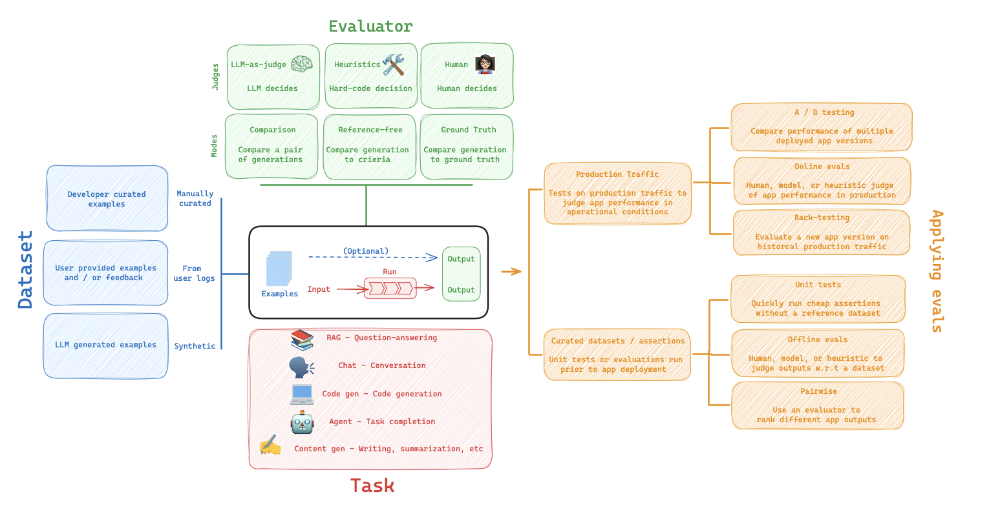

# Datasets & Evaluation 컨셉 가이드

LLM 어플리케이션을 평가하기 위한 데이터셋과 평가 방법 입니다.
데이터셋을 준비해두고, LangSmith 에 적재해둔 다음 Evaluator 에 보내줍니다.
Evaluator는 LLM 어플리케이션의 결과와 데이터에 준비된 결과를 보고 평가합니다.
여기서 Dataset 의 Output (정답) 은 필수 사항이 아닙니다.
정답이 있으면 좋겠지만, 없어도 평가를 할수는 있죠.




## Datasets

LangSmith 에서는 주요한 데이터셋을 다룰 수 있습니다.
단순 저장소이기 때문에 "이걸 왜 설명하지?" 라고 하실 수 있겠지만,
Tracing (추적) 이나, Evaluation (평가) 기능과 연동되어 동작하기 때문에 매우 유용합니다.

### 생성 방법에 따른 데이터 분류

데이터셋의 생성은 다음과 같은 방법으로 할 수 있습니다.
- 연구/개발자가 직접 작성 또는 선정한 데이터
	- Input 과 예상 Output을 직접 작성합니다. 문제집과 정답이죠. 수십개 수준정도로 데이터의 양이 작더라도 기준이 되는 데이터셋이기 때문에 중요합니다.
- 로깅된 데이터
	- LLM 어플리케이션이 서비스가 시작되었다면, 사용자의 tracing 결과들이 로그가 되어 데이터셋으로 편입될 수 있습니다. 실제 사용 예시이고, 사용자 피드백이 같이 있다면 더 가치있는 데이터가 됩니다.
- 합성 데이터
	- LLM 어플리케이션을 이용해서 직접 생성해낼 수 도 있습니다. 사람이 직접 검토하지 않는다면, 데이터가 저품질일 위험성이 있지만, 자동 생성되어서 양을 많이 늘릴 수 있습니다.

LangSmith 플랫폼은 위 3가지 방법으로 생성되는 데이터를 모두 쉽게 데이터셋에 추가할 수 있게 지원합니다.

제 경험상 다음과 같이 작업을 시도하는 것이 제일 좋은 것 같아요.
1. 가능하다면, 자동으로 데이터를 수집합니다, 베스트 케이스에 해당하고 조달 한계가 사실상 없습니다. 이런 경우라면 아래 2, 3 단계가 무의미 합니다.
2. 양질의 데이터가 충분하지 않다면, 연구/개발자가 데이터를 직접 작성합니다. (~100세트)
3. 현존 제일 똑똑한 모델로 합성 데이터를 생성합니다.
	1. 평가를 한번 돌려서 이상한 데이터는 손으로 직접 잡아줍니다.
4. 서비스를 운영하면서 로깅된 데이터를 추가합니다.

### LangSmith 의 데이터 타입

LangSmith 에서는 아래 3가지 타입으로 데이터가 구분됩니다.
- kv (key-value)
	- 일반적인 딕셔너리 형태와 같습니다. 가장 범용적이고, 다양한 evaluation 시나리오를 커버합니다.
	- 기본 타입이기도하고, 그냥 kv 타입 사용하면 웬만하면 됩니다.
- llm (large language model)
	- "completion" 스타일의 llm 평가를 위해 사용됩니다.
- chat
	- 채팅 스타일로 챗봇과 같은 대화 스타일 평가를 위해 사용됩니다.

### 데이터 셋 나누기

용도에 따라 데이터셋을 나눌 수 있습니다.  
작고 빠른 테스트용, 풀 테스트용 과 같이 테스트 규모에 따라서 나눌 수 있습니다.  
팩트 체크용 이라던가, 의견 제시용 이라던가, 다양한 task 를 수행해야하는 경우 task 별로 나누기도 합니다.  


## Evaluation (평가)

LLM 어플리케이션의 평가는 경우에 따라 매우 어려운 일입니다. 챗봇의 예를 들면, 대답이 얼마나 좋은지를 정량 평가 하기란 정답이 없는 문제입니다. 

> 다행히도 LangSmith에서는 다양한 평가 기준을 쉽게 구현할 수 있도록 제공합니다.
> 이것이 매우 유용하더군요.


### 주요 구성 요소

- ```Example``` : 데이터셋의 데이터 하나하나 입니다. 주로 In, Out 으로 구성되어 있습니다.
- ```Root_run``` : 하나의 시험 run 인데, LLM 어플리케이션은 여러개의 run 이 하나의 task가 되기 떄문에, 묶음 입니다. 사용자 입장에서 in/out 이라고 볼 수 있습니다. 
	- RAG application 을 예로 들면, Retrieval 도 run, Generation 도 run 이고, 묶어서 Root_run 입니다.

 위 ```Example``` 데이터들을 물고, ```Root_run``` 들을 수행하면, 결과가 나옵니다. 결과는 ```EvalutionResult``` (dictionary랑 유사한 클래스) 가 리턴되고, 아래 항목들을 가지고 있습니다.
 - ```Key```: 평가 지표 이름 (the name of metric)
 - ```Score``` : 평가 지표 값 (the value of metric)
 - ```Comment``` : 평가 근거, 사유. 어떻게 해서 평가 지표값이 도출 되었는지에 대한 해설.

### 평가 주체와 방법

#### Human

당연히 가장 좋은 평가자는 사람입니다. 사람이 직접 평가를 써주면 좋겠지만, 비싸기도 하고 전문성에 대한 검증 작업도 필요합니다. 우리가 원하는 것은 당연히 사람이 평가를 해주는 것은 아닐테죠. 그래도 시작 지점으로는 좋습니다. 대부분의 경우에 필수적이기도 합니다.

### Heuristic

다음 단계는 휴리스틱한 기법의 적용입니다. 사람이 "이렇게 평가하면 괜찮지 않을까?" 하는 가설을 세우고 직접 함수를 파이썬으로 구현하여 넣어줍니다. 단순한 단답형 QA 평가셋의 경우 정답과 정확히 일치하는지 테스트 하는 함수를 구현할 수도 있고, 정답 키워드가 포함 되는 지 테스트하는 함수를 구현할 수도 있습니다.
```Custom evaluator``` 를 구현하여 넣어주면 되니 자유도가 높으나, 평가 방법에 대한 신뢰도를 직접 판단해야합니다. 단순한 데이터셋에 대해서만 잘 작동하겠습니다.

### LLM-as-judge

LLM 을 판사로 사용합니다. 평가자로서 LLM 을 사용하고, 기준도 넣어주고 LLM 이 평가 점수와 이유까지 내줍니다. 전문가보다 더 잘 평가한다면 매우 강력하고, 시간도 단축되고, 비용도 줄고, 좋겠죠. 평가를 잘 하게 만드는 것 또한 하나의 LLM application 이라, 배보다 배꼽이 더 커질 수도 있습니다.  
- reference-free 한 평가
	- 답변이 공격성이 있는 지, 부정적인지, 간결한지, 등 정답지와 무관한 평가를 진행할 수도 있습니다.
	- LangSmith 에서는 conciseness, harmfulness, maliciousness 등 여러 기준에 대해 평가하는 LLM judge 를 템플릿 처럼 만들어서 제공합니다. 매우 유용합니다. 원버튼에 다양한 평가를 바로 수행가능하니까요.
- reference 가 필요한 평가
	- 데이터셋 example에 적혀있는 결과값과 비교하여 평가를 내릴 수도 있습니다. 
	- LangSmith 에서는 QA correctness, Context QA, Chain of Thought QA 와 같이 얼마나 대답이 정확한지 reference 와 비교하여 결과를 내리주기도 합니다.
	- LLM application 에 따라 평가 로직 개발이 어려울 수도 있습니다.

### Pairwise

비교 검사입니다. LLM-as-judge 가 판단을 잘 못 할 때 유용합니다.  
Summarization 을 예시로 생각해보면, 어떤 것이 잘 된 요약인지 판단하기가 어렵습니다.  
문체라던가, 분량이라던가, 개발자가 원하는 방식에 점수를 매기기 위해서 pairwise 로 두 결과를 눈으로 보고 비교하면, 효율적으로 평가를 할 수 있습니다.  


## Evaluation 적용하기



앞서 설명한 Evaluation 방법들을 실제로 적용을 해보겠습니다.

### Unit Tests

가장 기본적인 테스트 방법이죠. 대부분의 유닛테스트는 단순 assertion들 입니다. 절대 틀리면 안되는 것들을 체크해서, LLM application 이 변경 되었을 때, 문제들을 체크하고 배포가 되어도 되는지 자동으로 검사를 합니다.  
CI 단계로 통합을 시키는 것이 일반적일 테고, 가장 맞춰야 하는 테스트들을 넣어주면 됩니다.  
QA 테스트나, hallucination, harmfulness 같은 치명적인 오류들을 걸러내도록 데이터 셋을 구성합니다.  

### Regression Tests

다양한 evaluator들을 구성하고, 점점 발전하는 것을 점수화 해서 관리합니다.  
baseline 으로 부터 LLM application 을 발전시켜 나갈때, 점수가 올라가는 것을 관찰하기 좋습니다.  
다양한 데이터셋 example에 따라 비교를 해보면서 어떤 부분이 개선이 되었는지, 혹은 개선이 더 필요한지 비교해 볼 수 있습니다.  

### Back-testing

상용화를 하고 나면, 사용자들이 사용하면서 생성된 데이터셋을 추가로 확보하게 됩니다. 이 데이터를 사용하여 테스트 합니다.  
새로운 버전의 GPT 모델이 나오면, 최근 사용자들의 trace들을 1000개 정도 데이터셋으로 모으고, 신 모델로 변경 후 바로 비교테스트를 합니다.  
실 사용 유저들의 입장에서 모델 교체가 바로 적용가능한지 테스트 해볼 수 있습니다.  

### Online Evaluation

온라인 평가는 실제 서비스가 동작하고 있는 상황에서의 실시간 평가를 의미합니다.  
앞서 설명한 내용들은 대부분 오프라인 평가로 배포 이전 단계에서 좋은 LLM 어플리케이션을 만들기 위한 목적이 강합니다.  
온라인 평가는 서비스 단계에서 안전 장치 (guardrails) 구현 하는 데에 있어 유용합니다.  
예를 들면, 챗봇 서비스가 틀린 소리를 하는지, 혐오 표현을 하는지, 이런 항목들을 검사하도록 사용할 수 있겠죠.  
태그를 달아서 나중에 데이터 셋으로 추가하기위한 자동 분류를 한다거나, 여러가지 상황에 맞게 사용할 수도 있습니다.  

LangSmith 플랫폼에 함수를 등록해두거나, 웹훅으로 끌어가서 트레이스에 자동으로 평가 함수를 붙입니다.  

