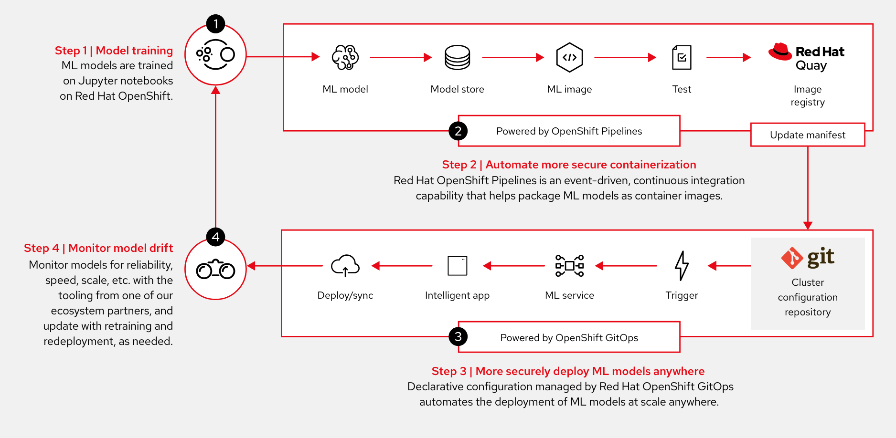

앞서 LangSmith 에 대해서 대략적으로 소개를 했습니다.

LangSmith 라는 플랫폼은 결국 LLM 기반 어플리케이션의 개발/운영 과정에 도움을 주는 도구인데요, 한마디로 분류하자면 LLMOps 라고 볼 수 있겠습니다. 이제는 LMMOps 라고 불러야 할 수도 있겠군요. 

LLMOps 라는 용어와 개념에 대해 명확히 정의하기가 어렵기 때문에 설명하고자 합니다.

# DevOps, MLOps, LLMOps

LLMOps 는 DevOps 로 부터 파생되어 나온 개념이라고 볼 수 있습니다.  
DevOps 부터 설명하도록 하겠습니다.

## DevOps

2007년정도 도입된 개념으로 NASA 의 절차와 아이디어를 모방하여 배포의 안정성을 높이려는 시도가 시초라고 합니다.  
핵심 목표는 개발, 테스트, 배포의 단계를 효율화 하는 것입니다. 개발팀, QA팀, 운영팀 (+ documentation팀) 모두가 걸쳐있는 단계라서 협업이 중요하죠.  
DevOps 도입 이전에는 개발 -> 테스트 -> 배포 -> 운영 과정이 너무 느리고 문제가 발생할 여지도 많고, 다양한 팀들 간의 소통에도 문제가 자주 발생 했었습니다.  

DevOps 는 여러 형태가 있지만, 현 시점 기준으로 많은 조직의 변화를 지켜본 결과 아래와 같은 모습이 되었습니다.  
- QA 팀은 해고되고, 개발팀과 운영팀이 하나의 팀으로 통합이 되어 빠른 배포를 달성함.
- 개발 브랜치의 커밋들이 메인 브랜치로 머지되면, CI/CD 시스템이 빌드, 테스트 후 자동으로 배포함.

요즘에는 Github 이나 Gitlab 에서도 CI/CD 를 잘 지원하죠. 조직 단위가 아닌 개인 단위로도 효율적인 방법론입니다. 최근에는 회의적인 시각들도 많이 있기는 합니다만, 채용 포지션에 DevOps 포지션이 있다는 것 만으로도 얼마나 대중적인 방법론인지 체감할 수 있습니다.  

DevOps 에 관심이 있으시다면 아래 두 가지 글을 읽어보시길 추천드립니다.  
DevOps 에 대한 아마존의 정의와 최근의 회의적인 시각에 대한 포스트 입니다.  

1. [DevOps에 대한 회의론](https://matduggan.com/a-eulogy-for-devops/)  
2. [AWS의 DevOps 정의](https://aws.amazon.com/ko/devops/what-is-devops/_)

## MLOps

DevOps 중에서 Machine Learning 과 관련된 부분을 따로 지칭하는 용어이자 개념, 분야입니다. 
ML 을 기반으로한 서비스들은 연구/개발 시에 데이터가 중요하죠.
그래서, 데이터와 학습을 중점적으로 한 개발, 테스트, 운영 프로세스에 집중합니다.

DevOps 와의 구체적인 차이점을 꼽으라면,
- 데이터 수집, 가공, 활용
- 모델의 학습, 검증, 배포, 모니터링
정도가 있겠습니다.

DevOps에서의 코드가 MLOps 에서의 데이터&모델 이라고 보면 되겠습니다.
아래 그림은 RedHat OpenShift 에서 바라보는 MLOps 의 개요입니다.

3. [Redhat의 MLOps 정의](https://www.redhat.com/rhdc/managed-files/cl-mlops-architecture-openshift-infographic-f31021-202202-en_1.pdf)

## LLMOps

MLOps에서 한발자국 더 나아가 LLM 을 위한 DevOps 입니다.
포함관계를 따져보면 `DevOps > MLOps > LLMOps` 라고 봐도 되겠죠.
LLM (Large Language Model) 도 결국 Machine Learning Model의 일종입니다.

한가지 강조하자면, 작금의 LLM 은 Language 를 넘어서 Multimodality로 변화하고 있기에 LMMOps 라고 부르기도 하고, 범용적인 모델이라는 뜻에서 FMOps (Foundation Models Ops) 라고 부르기도 합니다.
24년기준 LLMOps 라고 가장 많이 칭하기 때문에 LLMOps 라고 지칭하도록 하겠습니다.

기존의 모델 MLOps와의 차이점으로는
- Model 과 데이터가 이 매우! 매우매우매우 커졌다는 점
- LLM (또는 LMM, FM) 의 아웃풋이 정량평가가 어렵다는점
- 모델의 앞뒤로 붙는 Agent, Retriever 또한 모델이 자의적으로 판단하고 변형/수행한다는 점
- 사용자의 데이터를 수집하여 활용 하는 것이 중요해졌다는 점
정도로 요약할 수 있습니다.

따라서,
- Tracing & 유저 피드백 수집
- HIL (Human In the Loop)
- 큰 규모의 모델 & 데이터 관리, 튜닝, 평가, 검증, 배포
등의 기능이 요구 됩니다.

개인적으로는 평가, 검증 이 정답이 없는 문제이고, 사용자들의 이용 형태가 변화하면 새로운 평가, 검증 기법이 도입되어야 하기 때문에, 이를 빠르게 모니터링하고 적용시킬 수 있는 것이 가장 필요한 기능이 아닌가 싶습니다.

# LangSmith as a LLMOps

LangSmith 는 위 나열한 기능들을 충족하는 플랫폼입니다. 따라서, LLMOps라고 분류 할 수 있습니다.
이제 직접 사용해보면서 유용함을 체험보도록 하죠.