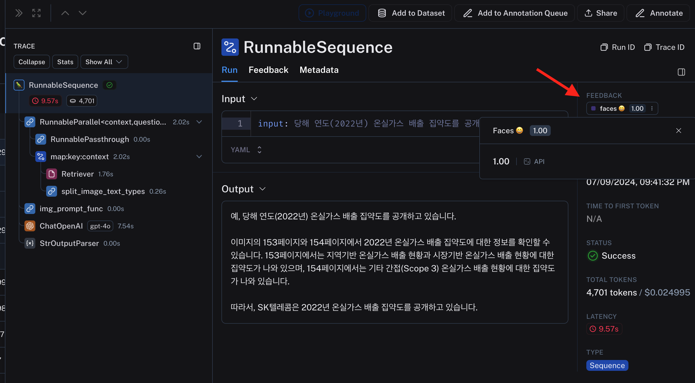

# Tracing 컨셉 가이드

LangSmith 에서 고안한 Tracing 컨셉 가이드 입니다.  
LangSmith는 Project >> Trace >> Run  단위로 데이터를 관리합니다.

## Run
- 하나의 In, 하나의 Out 입니다.
## Trace 
- 사용자 입장에서의 하나의 In, 하나의 Out 입니다.
- 예를 들어 RAG 라고 가정하면, Retrieve 가 하나의 Run, Generation이 하나의 Run 이라 합쳐서 하나의 Trace 입니다.

아래 보는 것과 같이 일반적인 LLM 어플리케이션은 여러개의 Run이 모여 하나의 Trace 가 되겠죠.

## Project

- 여러 개의 Trace 들 모음으로 운영자가 관리하는 단위입니다.
- 추적 기능을 활성화 할때, Project를 지정할 수 있습니다.

## Feedback

각각의 Run 에 피드백을 수집할 수 있습니다.
- 사용자가 피드백을 같이 날려줄 수가 있습니다.
- LangSmith 에서 운영자가 직접 달아 줄 수 있습니다.
- Evaluation 과정을 자동화해서 프로그램이 달아 줄 수 있습니다.

아래의 경우는 사용자가 피드백을 챗봇 어플리케이션에서 마킹 해준 경우 입니다. API 를 통해 수집 되었습니다.

# Tag & Metadata

이 외에도 태그랑 메타데이터를 추가로 달아줄 수 있습니다. 추가 정보를 달아 주는 개념이로 일반적인 데이터 관리에서의 태그랑 메타데이터와 개념이 같습니다. 역시 직접 LangSmith에서 달아줄 수도 있고, LLM 어플리케이션에서 같이 달아 줄 수도 있습니다.

> LangSmith 클라우드 서비스는 400일간 데이터를 보관해 줍니다. 그 이후에는 날라간다고 하네요.

## 참조
- [LangSmith 공식 문서](https://docs.smith.langchain.com/concepts/tracing)

