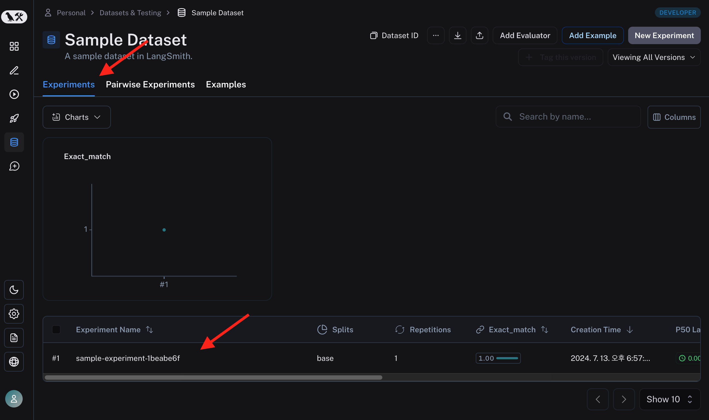
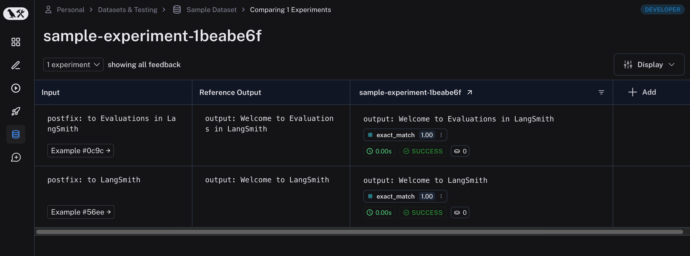

# Evaluation (평가)

데이터를 준비했으니 Evaluation 도 해보겠습니다.
먼저 가장 간단한 예시 부터 시작합니다.
필자 의견으로는 가장 유용한 기능이니 "Evaluation" 문서는 한 번 쭉 보시는 것을 추천드립니다.  

## Quick Start

아래 코드를 수행하면, 데이터셋을 만들고, example을 추가하고, 평가합니다.

``` python 
from langsmith import Client
from langsmith.evaluation import evaluate

client = Client()

# Define dataset: these are your test cases
dataset_name = "Sample Dataset"
dataset = client.create_dataset(dataset_name, description="A sample dataset in LangSmith.")

client.create_examples(
  inputs=[
    {"postfix": "to LangSmith"},
    {"postfix": "to Evaluations in LangSmith"},
  ],
  outputs=[
    {"output": "Welcome to LangSmith"},
    {"output": "Welcome to Evaluations in LangSmith"},
  ],
  dataset_id=dataset.id,
)

# Define your evaluator
def exact_match(run, example):
  return {"score": run.outputs["output"] == example.outputs["output"]}

experiment_results = evaluate(
  lambda input: "Welcome " + input['postfix'], # Your AI system goes here
  data=dataset_name, # The data to predict and grade over
  evaluators=[exact_match], # The evaluators to score the results
  experiment_prefix="sample-experiment", # The name of the experiment
  metadata={
    "version": "1.0.0",
    "revision_id": "beta"
  },
)
```

코드의 주요 요소는 다음과 같습니다.
- Datatsets 에 example 추가
- Evalutation 함수 정의 : exact_match
- 평가 대상인 LLM 어플리케이션은 간단하게 lambda 로 정의해 넣었습니다.
	- 단순 텍스트 치환함수 입니다.

Exact Match 테스트한 결과를 LangSmith에서 확인하면, 다음과 같습니다.  
Experiment 가 생겼고 그 결과가 표시됩니다. 


결과를 클릭하여 더 자세히 보겠습니다.  



각 데이터셋 example에 대해 LLM 어플리케이션의 output, 평가 결과까지 잘 매겨져 나왔습니다.
위에서 수행한 evaluation 도 Run 이고 Trace 이기 때문에 프로젝트에 추적 결과가 생성됩니다.  

![[evaluator_3.png]]

evaluators 라는 이름의 프로젝트로 trace 를 추적할 수 있습니다.  
예상과 다르게 평가 결과가 안 좋았다면, 그 이유를 찾는 디버깅이 가능하겠네요.  


## Custom Evaluator

위 간단한 예시에서는 exact_match, 정확하게 일치하는 지를 기준으로 평가했습니다. 문제집의 정답 채점하는 것 처럼요.  
LLM 어플리케이션의 가장 어려운 점은 평가가 정성적인 경우가 많다는 점 입니다.  
그래서, Evaluation을 제 맘대로 만들 수 있어야 합니다.  

위 exact_math 함수 처럼 맘대로 만들면 됩니다.
지켜야 할일은 in/out 형식만 잘 맞춰주면 되겠죠.
```python
from langsmith.schemas import Example, Run

def exact_match(root_run: Run, example: Example) -> dict:
    score = root_run.outputs.get("output") == example.outputs.get("label")
    return {"score": int(score), "key": "correct_label"}
```
input 은 Run, Example 입니다.
Run 은 Trace 에 추적되는 하나의 단위이고, Example 은 테스트할 데이터 이죠.  

output 은 dict 타입입니다. 여기에는 현재 score, key 가 달려 있는데, 평가 결과가 곧 피드백이기 떄문에 피드백의 형식을 지켜줘야합니다.  
자세한 내용은 [피드백 데이터 포맷](https://docs.smith.langchain.com/reference/data_formats/feedback_data_format) 문서를 참고하세요.  


## LangChain 내장 평가 함수

Custom Evaluator 로 평가 로직을 마음대로 만들 수 있는 것 좋습니다. 

> 그런데... 언제 다 만들죠. 어떻게 평가해야하는게 좋을까요??  

그래서 많이 쓰일 법한 평가 함수들은 이미 다 만들어져 있습니다.  
무엇보다도 [LLM as judge](../intros/Evaluation_with_dataset.md###LLM-as-judge), LLM 에게 채점을 시키는 방법이 구현이 되어있습니다.  
한번 보겠습니다. 

### Q&A Correctness

질문과 답 데이터 세트를 준비했다면, 내가 만든 LLM 어플리케이션 한테 시험을 보게 시키고 맞았는지 틀렸는지 확인해볼 수 있습니다.  
방금 위에서 본 ```exact_math``` 함수로 검사하면 되는게 아니냐고 생각하실 수 있는데요,  
  **아닙니다.**   
  
정답이 애매한 경우에 대해 채점을 더 잘 하고 싶은 경우를 생각해 보겠습니다.  

> Q: 장비의 무기는 무엇입니까?  
> A:  장팔사모

간단한 질답 세트입니다.  이 질문을 GPT에게 해봤더니, 이렇게 답했습니다. 

> 창 

이건 정답인가요?  장팔사모는 창이 맞긴 한데요. 채점 기준에 따라서 정답일 수도 아닐 수도 있겠죠.  
답변이 단답형이 경우에도 이런데 서술형이 되면 채점이 더욱 애매해집니다. 이런 경우를 해결하기 위한 langchain의 제시 방법을 살펴보겠습니다.  

```python 
from langsmith import Client
from langsmith.evaluation import LangChainStringEvaluator, evaluate

qa_evaluator = LangChainStringEvaluator("qa")
context_qa_evaluator = LangChainStringEvaluator("context_qa")
cot_qa_evaluator = LangChainStringEvaluator("cot_qa")

client = Client()
evaluate(
    ... ,
    data=dataset_name,
    evaluators=[qa_evaluator, context_qa_evaluator, cot_qa_evaluator],
)
```

LangChainStringEvaluator 에는 여러가지 correctness 체크를 방법을 제시합니다.  
위 코드에서는 "qa", "context_qa", "cot_qa" 를 사용했습니다.  

### 기타 평가 기준

Q&A Correctness 를 평가하는 로직을 사용했습니다. 이 외에도 다양한 평가 기준들이 있습니다. 답변이 얼마나 도움이 되는지, 말투가 공격적이지는 않는지, 여성혐오 표현이 있지는 않은지, 기타 내장 평가 기능들은 [SDK 문서](https://docs.smith.langchain.com/reference/sdk_reference/langchain_evaluators) 를 참조하세요.  
LangSmith의 Evaluation 기능 설명을 위해 자세한 내용은 생략합니다.  


## 평가 결과 및 채점 과정 열람

위에서 제가 지정한  Q&A 관련 채점 결과들이 피드백으로 붙어있습니다.  

![[../rsc/lc_eval.png]]

correct_label 은 위에서 만든 exact_match 랑 같은 검사 로직 입니다. 당연히 틀렸죠. "장팔사모" 와 "창" 은 텍스트가 다르니까요. 제일 엄격한 검사죠.  

`correctness`, `context correctness` 는 `INCORRECT` 라고 대답한 반면, `cot context correctness` 는 `CORRECT` 라고 대답했습니다.


![[../rsc/eval_trace.png]]

각 채점 항목을 클릭하면 어떻게 이런 채점이 되었는지 추적할 수 있습니다.  
혼자 다른 정답이라고 채점한 `cot context correctness` 의 채점 과정을 한번 보겠습니다.  

![[../rsc/eval_cot.png]]

채점 과정도 하나의 Trace 이기 떄문에 추적결과를 볼 수 있습니다. gpt-4 를 사용했고, 0.01 달러 정도 비용이 들었군요. 프롬프팅이 미리 다 되어있는데, 이름 처럼 cot, Chain of Thought 과정이 구현이 되어있습니다.  
gpt-4 가 왜 정답이라고 처리 했는 지 output을 보면, 장비가 원래 창을 쓴다는 사실을 학습을 통해 알고 있었기 때문에 정답이라고 처리 했다는군요.  

다른 항목들은 이 문서에서는 너무 길이지니 생략하겠습니다. LangChain이 미리 만들어둔 채점 프롬프팅을 바로 사용할 수 있다는 것이 참 편리하고 좋습니다.  

## 평가 결과 통계 열람

이 과정을 모든 데이터 셋에 대해서 다 수행하고 결과를 내주기 때문에, Q&A 데이터 셋이 많다면, 질답 퀄리티가 살짝 부족해도 양으로 해결할 수 있습니다. 

![[../rsc/eval_various.png]]

여러 질답 데이터셋에 대한 한번의 평가 입니다. 각 질답에 대해 다양한 채점기준의 채점 결과가 모두 달려 기록된 것을 볼 수 있습니다.  

![[../rsc/eval_experiments.png]]

LLM 어플리케이션을 바꿔가면서 evaluation 을 여러번 수행하면, 평가 점수를 이렇게 비교해볼 수 있습니다. LLM 어플리케이션의 발전 과정을 정량화해서 볼 수 있습니다.  


