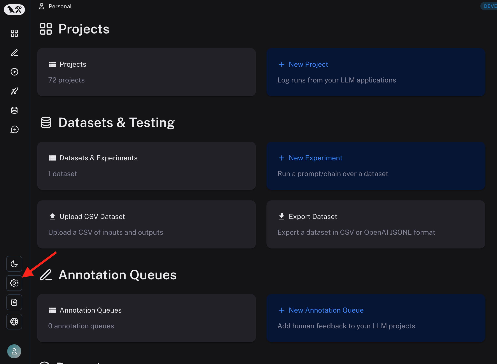
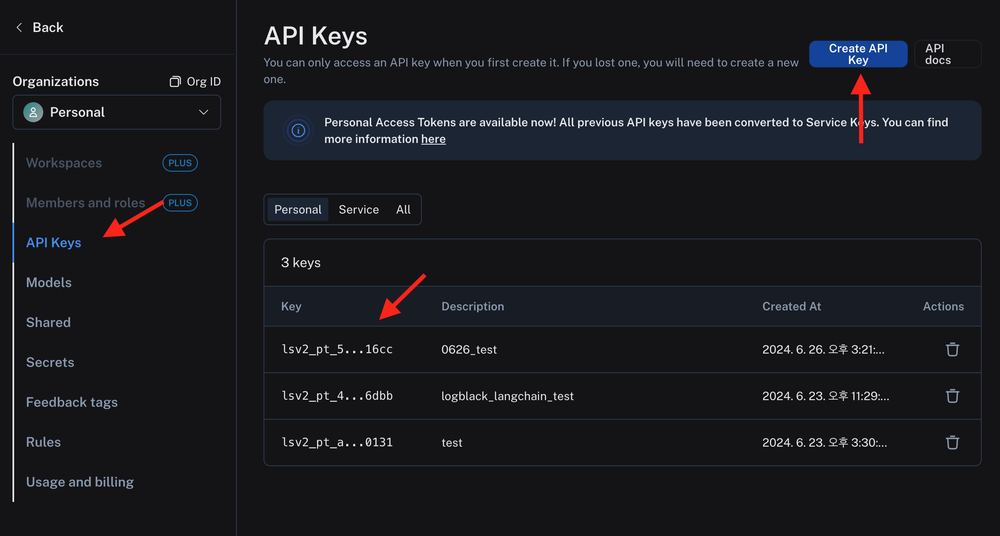
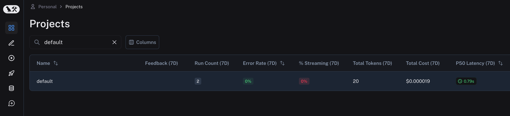
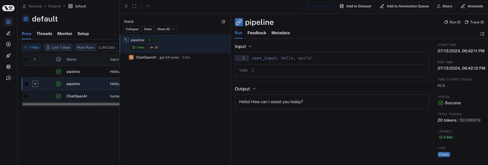

# Setup & Quick Start

LangSmith 는 LangChain 에서 제공하는 서비스 이기 때문에 가입하고 API Key를 받아야 합니다.

> LangChain의 클라우드로 데이터를 보내지 않고 직접 호스팅해서 사용하는 것 또한 가능합니다. ([FAQ #1](../FAQ.md))

## API key 발급

아래와 같이 [LangSmith 웹사이트](https://smith.langchain.com/) 에 접속하면 대시보드가 보입니다.



설정에 진입 하면 API 키를 발급받을 수 있습니다.



이 API 키를 코드에서 사용하면 됩니다.

첫 사용을 위한 준비는 벌써 끝 입니다.
무료 사용을 충분히 지원하기 때문에 (매월 5000거의 추적) 테스트 단계로는 무리가 없습니다.


## 설치

이제 LLM 어플리케이션 쪽에서 LangSmith 로 데이터를 날려주어야 하는데, LLM 어플리케이션 코드는 Python 이라고 가정을 하고 설명하겠습니다.
꼭 Python을 사용해야하는 것은 아니지만, 이 분야에서 가장 대중적인 Python을 기준으로 작성하겠습니다. Typescript 도 지원하고, REST API 를 사용해서 언어 불문하고 사용이 가능합니다. (참조 - [FAQ #2](../FAQ.md) )

pip 를 이용해서 필요 패키지를 설정해 줍니다.

``` sh
pip install -U langsmith
```


## Quick Start


환경 변수를 설정해 줍니다. 앞서 발급받은 api key 를 설정해주면 됩니다.
테스트를 위해 GPT 를 사용해 볼 예정이라 OPENAI 에서도 api key를 발급받아서 입력하겠습니다.


``` python
import os

os.environ["LANGCHAIN_TRACING_V2"]="true"
os.environ["LANGCHAIN_API_KEY"]=""

os.environ["OPENAI_API_KEY"]=""
```


이제 Tracing (추적) 을 해보겠습니다.
여기서는 ```wrap_openai``` 함수와  ```@traceable``` 데코레이터 두 가지를 사용했습니다.
Openai 로의 요청과, traceable 를 달고 있는 함수가 모두 LangSmith 로 로깅되어 추적이 가능해집니다.


``` python 
import openai
from langsmith.wrappers import wrap_openai
from langsmith import traceable

# Auto-trace LLM calls in-context
client = wrap_openai(openai.Client())

@traceable # Auto-trace this function
def pipeline(user_input: str):
  result = client.chat.completions.create(
  messages=[{"role": "user", "content": user_input}],
  model="gpt-3.5-turbo"
)

return result.choices[0].message.content

pipeline("Hello, world!")
# Out: Hello there! How can I assist you today?
```


실제 추적된 결과를 한번 보겠습니다.

[LangSmith 웹사이트](https://smith.langchain.com/) 에 접속하여 Project 페이지를 보면 "default" 라는 이름이 프로젝트로 추적 결과가 생겼습니다. 위에서 프로젝트 명을 명시하지 않았기 때문입니다.




default 프로젝트를 클릭하면, run 된 결과들을 볼 수 있습니다.
@traceable 로 노테이션한 함수 pipeline 도 보이고, 그 안에 openai 로 요청된 gpt 의 결과도 보입니다.
비용, 소요 시간, 실제 요청된 시간, 모두 다 추적이 완성되었습니다.




