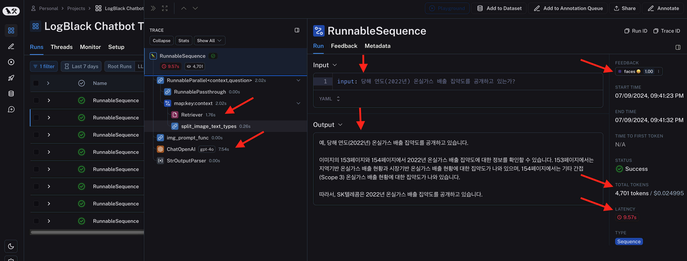
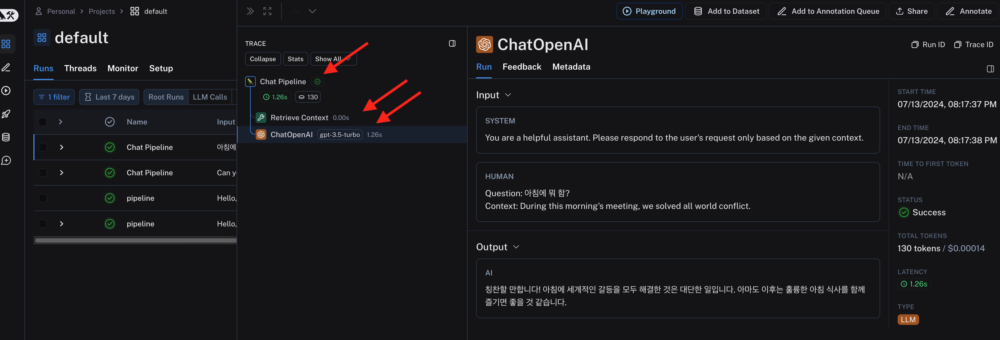
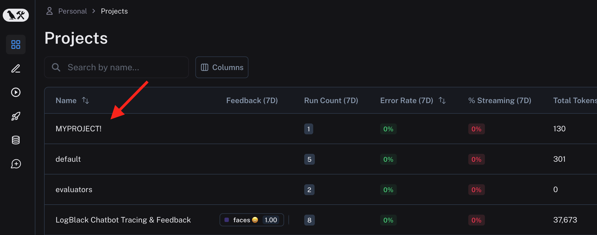
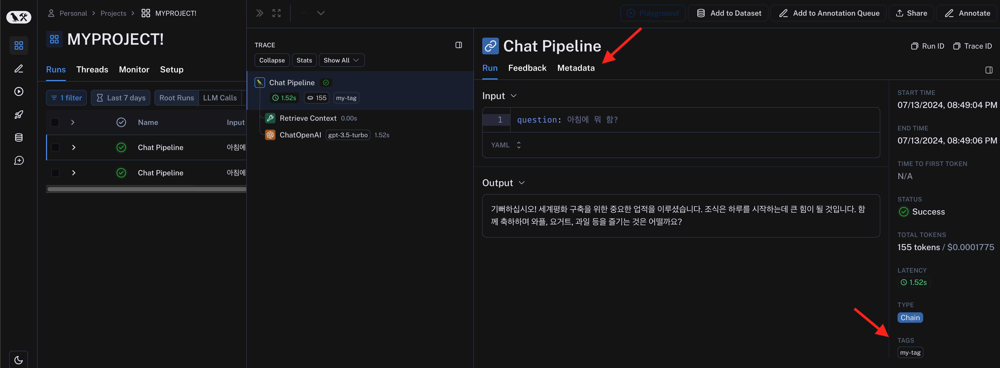
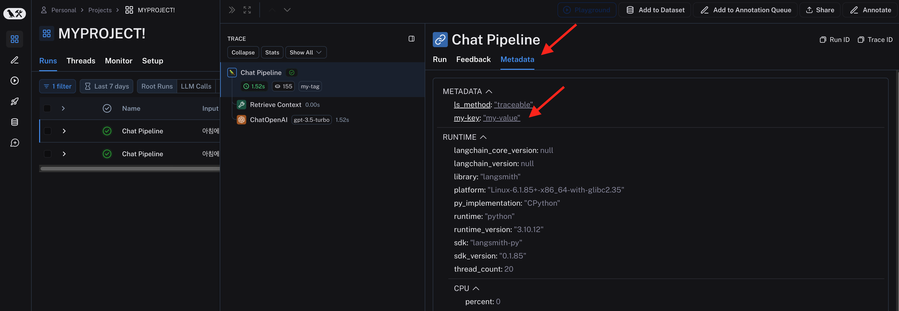

# Tracing 기초


LLM 어플리케이션의 각 과정들을 추적합니다.
LangSmith 에서는 추적, Tracing 이라고 정의 하고 있지만, Logging (로깅) 이랑 개념이 같습니다.

예를 들어 챗봇을 구성했다고 가정하면, 사용자들의 챗 history 와 LLM 어플리케이션이 답변한 과정을 모두 남겨 관리합니다. 디버깅 용으로 사용할 수도 있고, 충분히 빠르게 답변하는지, 비용은 얼마나 발생했는지, 사용자는 만족을 했는지 모두 관리가 가능합니다.


## 결과 미리보기

Tracing 예시 입니다.
하나의 대화에 대해 Retriever 의 결과, 최종 output, 각 단계에서 소요된 시간, 발생한 비용, 사용자의 피드백 수집 결과 까지 모두 관찰이 가능합니다.
Tracing 옵션 설정에 따라 모든 대화를 수집하는 것, 일부만 수집하는 것도 가능합니다.




## 구현

먼저 [Setup](Setup.md) 를 참조하여 환경변수 설정을 먼저 해줍니다.

추적을 하는 방법은 크게 3가지가 있습니다.
- ```@traceable``` 데코레이터를 사용하는 것
- ```wrap_openai```와 같은 ```wrapper``` 함수를 사용하는 것
- LangChain 을 이용해서 LLM 어플리케이션을 구현하는 것

이 외에도 ```RunTree``` 클래스라던가,  REST API 호출이라던가 다른 방식의 구현이 가능하지만, 생략하도록 하겠습니다.


간단하게 위 두가지 방법을 사용한 예시를 보겠습니다.

``` python
import openai
from langsmith import traceable
from langsmith.wrappers import wrap_openai

client = wrap_openai(openai.Client())

@traceable(run_type="tool", name="Retrieve Context")
def my_tool(question: str) -> str:
  return "During this morning's meeting, we solved all world conflict."

@traceable(name="Chat Pipeline")
def chat_pipeline(question: str):
  context = my_tool(question)
  messages = [
    { "role": "system", "content": "You are a helpful assistant. Please respond to the user's request only based on the given context." },
    { "role": "user", "content": f"Question: {question}\nContext: {context}"}
  ]
  chat_completion = client.chat.completions.create(
  model="gpt-3.5-turbo", messages=messages
)

return chat_completion.choices[0].message.content

chat_pipeline("아침에 뭐 함?")
```

Prompting 이 추가된 아주 간단한 LLM 어플리케이션 입니다.
- GPT 에 보내는 openai client 를 wrap_openai 로 감싸서 추적을 추가했고,
- Prompting 을 위해 컨텍스트를 추가하는 ```my_tool()```에 ```@tracable```을 추가해서 추적했고,
- 위 두 작업을 진행하는 ```chat_pipeline```에도 추적을 추가했습니다.

LangSmith 페이지에서 확인 가능한 결과를 보겠습니다.



추적을 킨 3가지 요소가 모두 추적이 되었습니다.

```@traceable(run_type="tool", name="Retrieve Context")``` 의 코드에서 볼 수 있는 각 추적을 나타내는 요소까지 잘 표기가 되었습니다.

얼마나 복잡해지든 원하는 요소 모두 다 추적을 달아주면 됩니다.


## 프로젝트 설정하기

현재는 프로젝트 이름을 설정하지 않았기 떄문에, 모두 "default" 프로젝트로 추적 결과가 수집됩니다.
프로젝트 명을 설정해주면 원하는 프로젝트 단위로 추적 결과들을 모을 수 있습니다.
프로젝트 설정 하는 방법으로는 아래와 같은 방법이 있습니다.

- 환경 변수 ```LANGCHAIN_PROJECT``` 에 이름을 설정합니다.
```python
os.environ["LANGCHAIN_PROJECT"]="MYPROJECT!"
```

- ```@traceable``` 데코레이터에 프로젝트 이름을 설정합니다.
``` python
@traceable(run_type="llm", project_name="MYPROJECT!")
```

- wrapper 함수에 프로젝트 이름을 설정합니다.
``` python
from langsmith import wrappers  
wrapped_client = wrappers.wrap_openai(client)  
wrapped_client.chat.completions.create(  
  model="gpt-3.5-turbo",  
  messages=messages,  
  langsmith_extra={"project_name": "MYPROJECT!"},  
)
```

프로젝트 명을 설정하면 그 이름에 맞는 프로젝트가 생성되고 그 하위에 추적 결과들이 적재됩니다.



> Trace 들은 트리 구조로 포함관계가 있기 때문에, 가장 바깥의 함수에 프로젝트명을 잘 표기해야합니다.


## Sampling Rate

추적 기능을 켜면, 모든 수행 결과들이 LangSmith 에 기록됩니다. 결국 데이터가 쌓이는 것이기 때문에, 서비스가 활발히 돌아간다면, 모든 Run 을 추적하는 것이 과도할 수 있습니다.
그래서, 추적을 남길 비율을 지정할 수 있습니다.

``` python
os.environ["LANGCHAIN_TRACING_SAMPLING_RATE"]=0.75
```

위와 같이 환경 변수를 설정하면 비율을 설정 할 수 있습니다.


## Metadata 와 Tag 추가하기

trace 들은 추가 정보를 아래와 같이 입력할 수 있습니다. 

``` python
@traceable(  
...
tags=["my-tag"],  
metadata={"my-key": "my-value"}  
)
```

아래와 같이 추가된 tag 와 메타데이터를 확인 가능합니다.





Tracing 의 기본 기능은 여기까지 정리를 하고, 나머지는 고급 기능으로 분류해서 다음 글에서 이어 작성합니다.
대부분은 여기까지만 궁금하실 것 같아서요.


