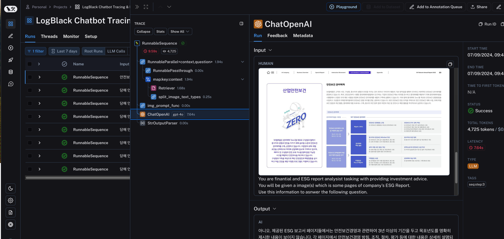
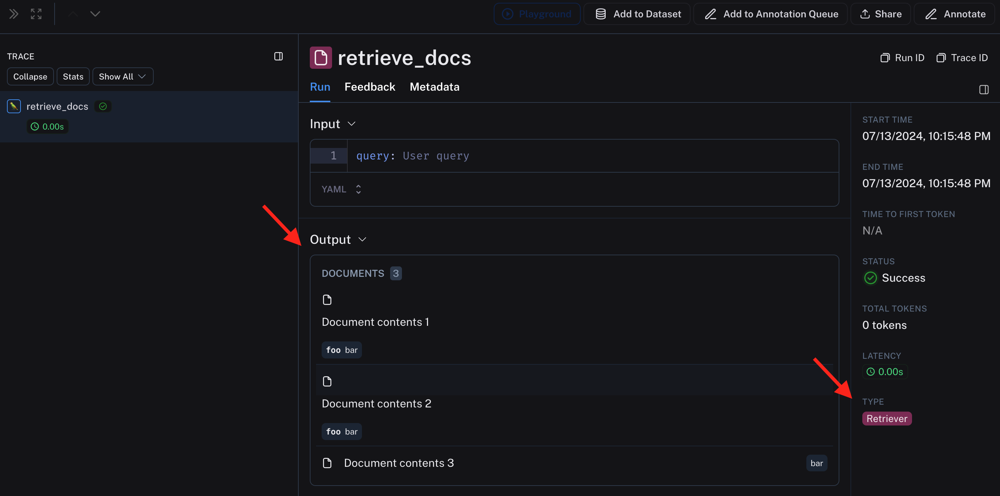
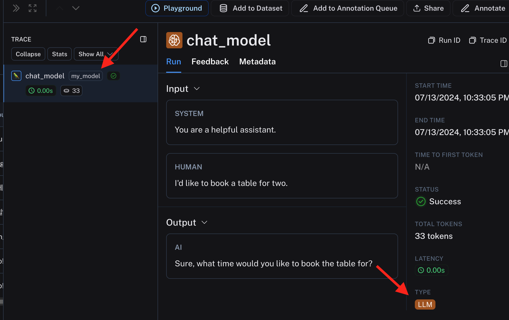

# Tracing 고급


기본 기능에 이어 추가적인 기능들을 설명합니다.


## Multimodality (멀티모달리티)

LangSmith 는 언어만 trace 하는 것이 아니라 image 도 추적됩니다.
추가적인 조치를 취할 필요는 없습니다.
Image를 URL 또는 base64 형태로 retrieve 했거나, 모델에 전달 했다면 아래와 같이 추적이 됩니다.




## Retriever

많은 LLM 어플리케이션은 retriever 를 동반합니다.
아래와 같이 traceable 데코레이터에 run_type 을 retriever 로 지정해 주면 이에 걸맞는 추적 결과가 기록됩니다.
```python
@traceable(run_type="retriever")
```

Retriever 는 아래와 같은 결과를 return 해야만 LangSmith에 retreiver 형태로 기록합니다.
Python 기준 딕셔너리를 return 해야만하고, 그 key 는 다음과 같습니다.
- `page_content`: 내용 입니다.
- `type`: "Document" 라는 값을 가져야만 합니다.
- `metadata`: 메타 데이터 딕셔너리 이고, LangSmith 에서 메타데이터로 표시됩니다.

아래와 같이 코드를 작성하여 수행하면,
``` python
from langsmith import traceable

def _convert_docs(results):
    return [
        {
            "page_content": r,
            "type": "Document",
            "metadata": {"foo": "bar"}
        }
        for r in results
    ]

@traceable(run_type="retriever")
def retrieve_docs(query):
    # Foo retriever returning hardcoded dummy documents.
    # In production, this could be a real vector datatabase or other document index.
    contents = ["Document contents 1", "Document contents 2", "Document contents 3"]
    return _convert_docs(contents)

retrieve_docs("User query")
```

다음과 같이 Retriever 타입으로 명시가 되어 추적이 됩니다.



결과만 보면 무슨차이가 있나 싶으실 수도 있겠지만, 많은 과정이 추가된 상태에서는 구분이 중요합니다. 왜냐하면 Agent는 Retrieve를 반복적으로 여러번 수행할 수도 있고, 다른 행위들 (ex, tavily 같은 검색) 과의 상호작용을 잘 관찰해야할 필요가 있습니다.


## Custom LLM

현재까지는 OpenAI 의 Chat API 호출만을 추적했습니다.
LangSmith 에서는 OpenAI 호출을 기본으로 보는 것 같습니다. 토큰 추적이나, builtin 추적 기본 기능들을 항상 OpenAI API 먼저 지원하더군요.
우리는 Google Gemini를 사용할 수도 있고, Antropic 의 Claude 를 사용할 수도 있고, 직접 호스팅하는 모델들을 사용할 수도 있죠. Meta Lamma 라던가, fine-tune 된 모델을 huggingface 에서 주워 온다던가.
다양한 모델들을 구분해서 추적할 수 있습니다.

LLM 모델의 호출은 크게 **Chat-Style** 과 **Instruction-Style** 로 구분할 수 있는데, 두 가지 경우로 나눠서 보겠습니다.

1. Chat Style (OpenAI 의 Chat Completion API 형식)

아래와 같이 코드를 작성하면,
```python
from langsmith import traceable

inputs = [
    {"role": "system", "content": "You are a helpful assistant."},
    {"role": "user", "content": "I'd like to book a table for two."},
]

output = {
    "choices": [
        {
            "message": {
                "role": "assistant",
                "content": "Sure, what time would you like to book the table for?"
            }
        }
    ]
}

@traceable(
    run_type="llm",
    metadata={"ls_provider": "my_provider", "ls_model_name": "my_model"}
)
def chat_model(messages: list):
    return output

chat_model(inputs)
```

아래와 같이 LLM 모델이 "my_model"로 설정된 것을 볼 수 있습니다.
다양한 모델들을 내 마음대로 설정해서 추적을 남길 수 있습니다.
튜닝된 여러 모델들을 A/B 테스트 할때 필요하겠네요.
 


2. Instruction-Style (String in/out 형식)

아래와 같이 코드를 작성하면,
``` python
@traceable(
    run_type="llm",
    metadata={"ls_provider": "my_provider", "ls_model_name": "my_model"}
)
def hello_llm(prompt: str):
    return {
        "choices": [
            {"text": "Hello, " + prompt}
        ],
        "usage_metadata": {
            "input_tokens": 4,
            "output_tokens": 5,
            "total_tokens": 9,
        },
    }

hello_llm("polly the parrot\n")
```

아래와 같이 결과가 나옵니다. 역시나 모델명을 제 마음대로 설정할 수 있습니다.
chat 형식이 아니라 이어진 String 을 한번에 볼 수 있고, 메타데이터로 전달한 token 갯수도 추적이 되어 표시됩니다.
OpenAI의 API는 토큰 갯수에 연동되어 비용도 추적이 되지만, 커스텀 모델은 비용 정보가 없으므로 계산이 되어 나오지는 않습니다. 메타데이터로 추가하면 될 텐데, 아직은 지원을 안하나 봅니다.
 


이 외에도 다양한 기능들이 더 있습니다. 자세한 사용법은 생략하고 개념과 설명만 기술하겠습니다. 자세한 내용은 [공식 문서](https://docs.smith.langchain.com/how_to_guides/tracing)를 참조하세요

## Distributed Tracing

LLM 어플리케이션은 복수개의 서비스가 연동되어서 동작할 수가 있습니다. 이럴 때에도 하나의 Run으로 추적을 해야합니다. API 호출을 갔다 오면서 같이 데이터를 넘겨 이어서 추적을 할 수 있습니다. 
문제는 API 를 받아주는 서비스에 추적을 달아야 하기 때문에, 모두 제가 코드를 수정할 수 있어야만 합니다.

## 데이터 숨기기 

민감한 데이터가 있는 경우, 데이터만 가려서 추적을 하고 싶을 수 있습니다.
LLM 어플리케이션이 얼마나 호출이 되고 있는지, 빠르게 처리가 되고 있는지, 사용자는 만족을 하고 있는지 모두 추적하고 싶지만, 데이터가 공개되지 않았으면 하는 경우에 사용할 수 있겠군요.
아래 환경 변수를 잘 설정해주면 됩니다.

```
LANGCHAIN_HIDE_INPUTS=true
LANGCHAIN_HIDE_OUTPUTS=true
```

## 추적 결과 공유하기

추적된 Run 을 우측 상단에서 공유할 수 있습니다.
클라우드로 호스팅 되고 있는 LangSmith 의 경우 링크가 생성되어 웹 URL로 공유가 됩니다.
Project 단위로 공유를 하고 싶었던 경우가 있었는데, 이는 안되고 Run 단위로만 됩니다.
시간이 지나면 Project 단위로도 지원을 해주겠죠...?


## 추적 결과 데이터 처리하기

본 문서는 LangSmith 의 웹 인터페이스로 접근해서 데이터를 다루고 있습니다.
당연히 코드로도 직접 원하는 데이터들을 필터링 하고, export 하고, 처리할 수 있습니다.
SDK 에 모두 포함되어 있습니다.